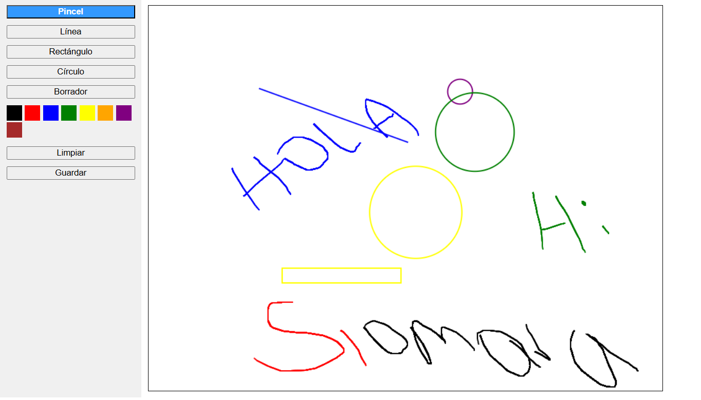

# 🖌️ Paint Web

Este proyecto es una aplicación web parecida a Microsoft Paint. Fue hecha con HTML, CSS y JavaScript.

## 👀 ¿Qué hace?

Permite dibujar en el navegador usando herramientas básicas como:
- Pincel
- Línea
- Rectángulo
- Círculo
- Borrador

También puedes:
- Cambiar el color
- Limpiar todo
- Guardar tu dibujo como imagen

---

## 🧑‍💻 ¿Cómo se usa?

1. Elige una herramienta (pincel, línea, etc.).
2. Elige un color.
3. Dibuja haciendo clic y moviendo el mouse en el canvas (área blanca).
4. Si quieres borrar todo, haz clic en **Limpiar**.
5. Si quieres guardar tu dibujo, haz clic en **Guardar**.

---

## 🎨 Herramientas

| Herramienta  | Lo que hace |
|--------------|-------------|
| Pincel       | Dibuja libre como un lápiz |
| Línea        | Dibuja una línea recta |
| Rectángulo   | Dibuja un cuadro |
| Círculo      | Dibuja un círculo |
| Borrador     | Borra partes del dibujo |

Colores disponibles: negro, rojo, azul, verde, amarillo, naranja, morado y café.

---

## 📷 Capturas de pantalla

---

## 🔧 Hecho con

- HTML (estructura)
- CSS (diseño y animaciones)
- JavaScript (funcionalidad del dibujo con canvas)
